footer:@johnsonch :: Chris Johnson :: Starting with Particle.io
autoscale: true
theme: Simple, 2

# Getting Started with Photon
## Blinking lights for fun

---
# Who am I?

### Chris Johnson
### @johnsonch => most places on the internet
### Dev Manager @ Rosh Review

---
# Disclaimer/Talk Rules

* These are based on my personal experience, YMMV
* I thought this was something cool to talk about, I have not made anything 'production' ready
* If you know more than me or can correct me, speak up.
* If you have questions please ask!
* If you want to argue about something, buy me a beer later.


[.build-lists: true]

---
# Why am I giving this talk?

^ This topic really interested me and I struggled a little bit getting started. I hope to inspire you and help you avoid some frustration I had.

---
## IoT LOL WUT?

> The Internet of things (IoT) is the inter-networking of physical devices, vehicles (also referred to as "connected devices" and "smart devices"), buildings, and other items—embedded with electronics, software, sensors, actuators, and network connectivity that enable these objects to collect and exchange data. - Wikipedia

---
# What is a Photon

> A tiny, reprogrammable Wi-Fi development kit for prototyping and scaling your Internet of Things product

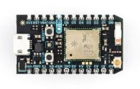

---
# Who is Particle

> Particle is a scalable, reliable and secure Internet of Things device platform that enables businesses to quickly and easily build, connect and manage their connected solutions.


---
# Where can I get stuff?
* [store.particle.io](https://store.particle.io/)
* [Amazon](https://www.amazon.com/Particle-Maker-over-components-Learning/dp/B01HZFS0PE/ref=sr_1_3?ie=UTF8&qid=1492801419&sr=8-3&keywords=particle)
* [Getting Started with the Photon](https://www.amazon.com/Getting-Started-Photon-Affordable-Hackable/dp/1457187019/ref=pd_sim_328_2?_encoding=UTF8&pd_rd_i=1457187019&pd_rd_r=9PZMMZ7B9V11P9KTT2TX&pd_rd_w=0TPLW&pd_rd_wg=vXMlx&psc=1&refRID=9PZMMZ7B9V11P9KTT2TX)

---
# What are we going to build?

## Build status light

---


---
# How do you get started?
* Buy some hardware
* Signup at [https://www.particle.io/](https://www.particle.io/)
* Download the smartphone app

---
# Tinker Mode

---
# Let's try it out

---
## Tinker Demo
### Setting up the Photon

* This is also how you connect to a new WI-FI, just make sure you don't skip ahead and connect to the devices network before hitting ready on this screen.

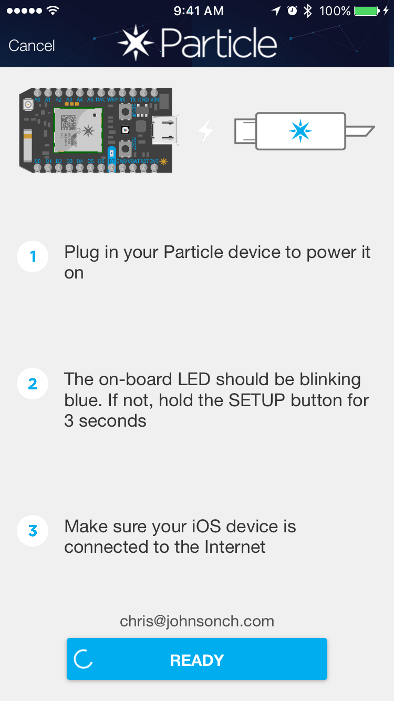

^ The smart phone app guides you very well

---
## Tinker Demo
### Setting up the Photon

* The device emits it's own wireless network for setup.

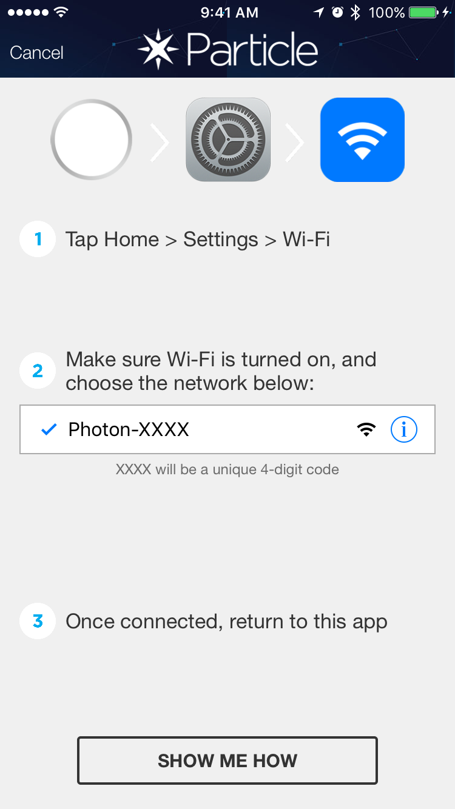

---
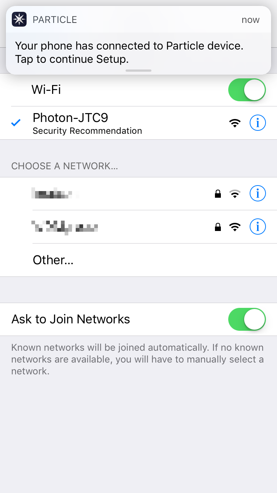

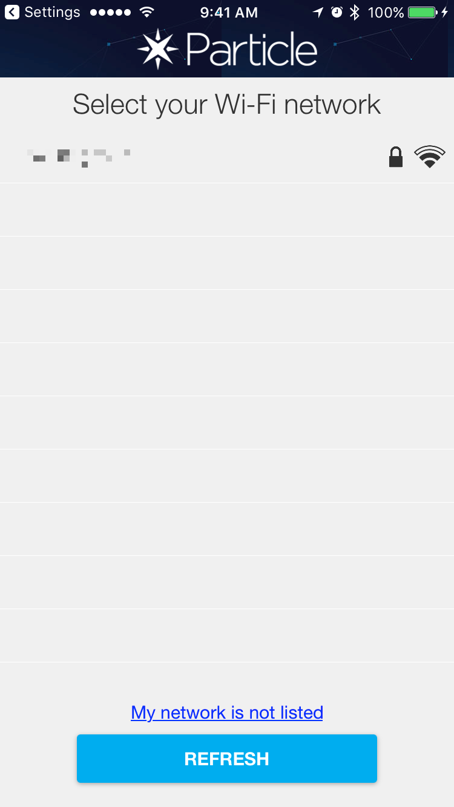

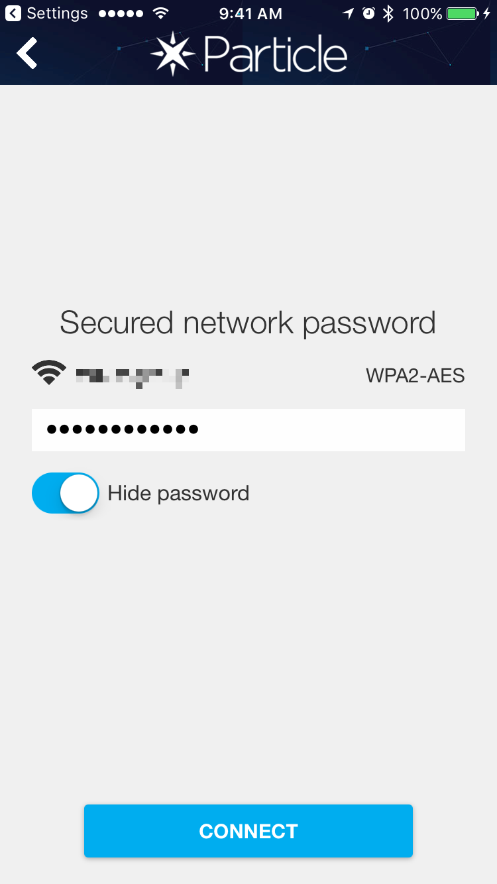

---
## Tinker Demo
### Setting up the Photon

* They give you funky names, you can however rename it if you want

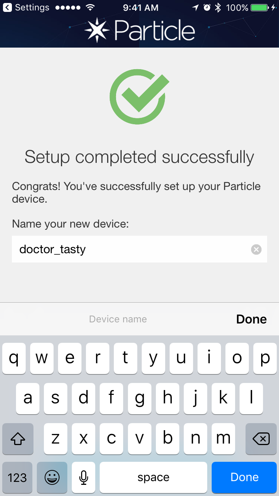

---
## Tinker Demo
### Playing with your device

* Tinker mode gives you a gives you a virtual interface to your board.
* We have two lites already attached to our bread board, let's light up the Red one

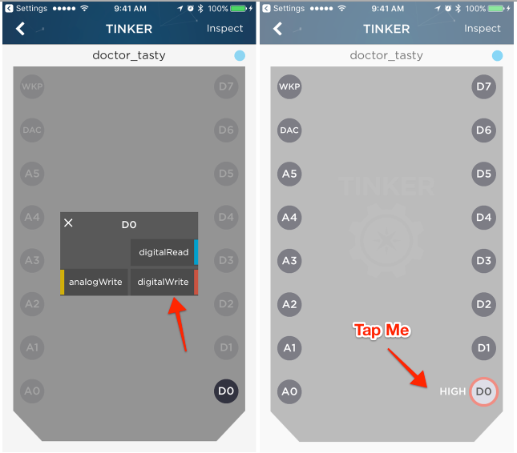


---
## Tinker Demo
### Playing with your device

* We blinked a light over the internet!

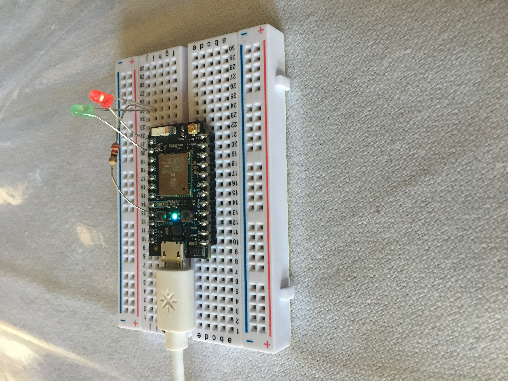

---
# That's cool but...
## I can't just watch the build status and click a button

---
# To the cloud


---
# build.particle.io

* Online editor
* JavaScript based DSL
* [https://build.particle.io](https://build.particle.io)

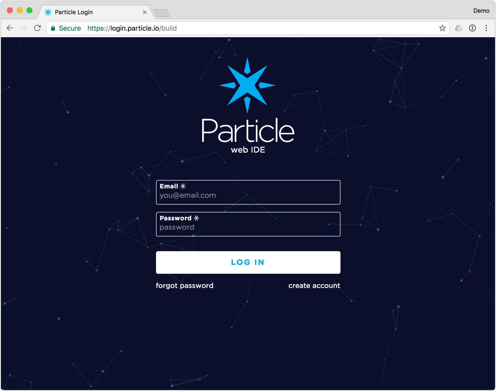

---
# Sample App

* They have a few, we'll try the `BLINK AN LED` app

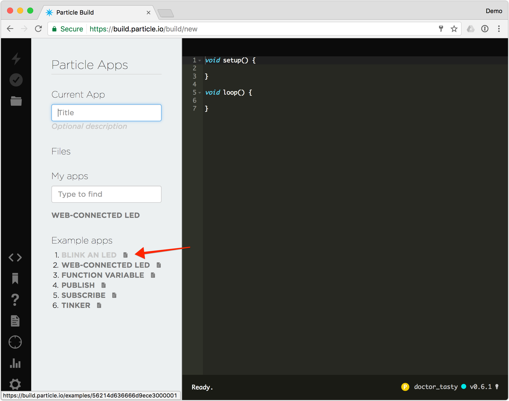

---
# Sample App

* To send it to our Photon we just need to `flash` the device
* Well it is sending to our device let's look at the code

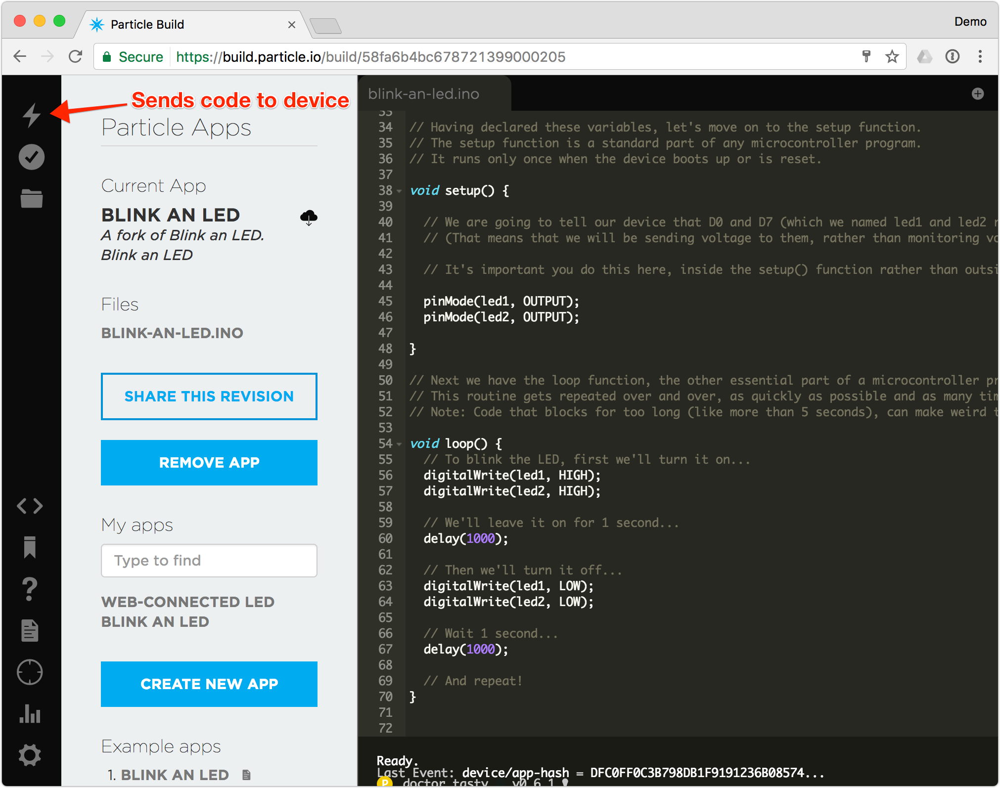

---
# blink-an-led.ino

```javascript
int led1 = D0;
int led2 = D7;

void setup() {
  pinMode(led1, OUTPUT);
  pinMode(led2, OUTPUT);
}

void loop() {
  digitalWrite(led1, HIGH);
  digitalWrite(led2, HIGH);

  delay(1000);

  digitalWrite(led1, LOW);
  digitalWrite(led2, LOW);

  delay(1000);
}

```
[Direct Link](./code_samples/blink-an-led.ino)

---


---
# Profit

---
# Now let's build something we can control


---
# Creating a new app

* From the cloud IDE choose 'CREATE NEW APP'
* Call it something like `travis-ci-blink`
* Then add the code from [travis-ci-blink.ino](./code_samples/travis-ci-blink.ino)
* Then flash it to your Photon

---
# Let's look at the code

---

```javascript
SYSTEM_MODE(AUTOMATIC);

int red = D0;
int green = D1;

void setup()
{

   pinMode(red, OUTPUT);
   pinMode(green, OUTPUT);
   Particle.function("led",ledToggle);

   digitalWrite(red, LOW);
   digitalWrite(green, LOW);

}


int ledToggle(String command) {
  if (command=="red") {
      digitalWrite(red,HIGH);
      digitalWrite(green,LOW);
      return 1;
  }
  else if (command=="green") {
      digitalWrite(red,LOW);
      digitalWrite(green,HIGH);
      return 0;
  }
  else {
      return -1;
  }
}
```

---
# Now to interact with it.

* Using the [Particle API](https://docs.particle.io/reference/api/)
* You'll need your Device ID and Access Token

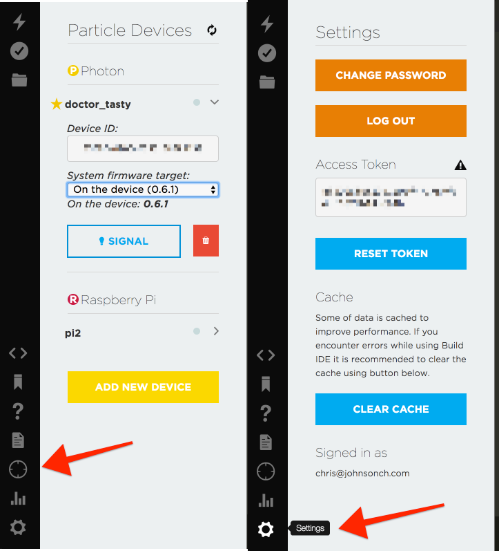

---
# curl request to API

```bash
#!/bin/bash

$ACCESS_TOKEN="REDACTED"
$DEVICE_ID="REDACTED"

curl -X POST -H "Content-Type: application/x-www-form-urlencoded" \
-H "Cache-Control: no-cache"  \
-d "access_token=${ACCESS_TOKEN}&arg=green" "https://api.particle.io/v1/devices/${DEVICE_ID}/led"
```

---
# On to Travis

* Create a new build process on https://travis-ci.org
* Then update the `.travis.yml` to contain blocks to call `curl` requests for success and failures.

---
# Sample `.travis.yml` for a Rails project

```yaml
language: ruby
cache: bundler
rvm:
  - 2.3.0
script:
  - bundle install --without production
  - bundle exec rails db:migrate
  - bundle exec rails test
after_success:
  - ./ci/success
after_failure:
  - ./ci/failure
```

---
# ci scripts

Failure

```bash
#!/bin/bash

curl -X POST -H "Content-Type: application/x-www-form-urlencoded" -H "Cache-Control: no-cache" \
-d "access_token=${ACCESS_TOKEN}&arg=red" \
"https://api.particle.io/v1/devices/${DEVICE_ID}/led"
```

Success

```bash
#!/bin/bash

curl -X POST -H "Content-Type: application/x-www-form-urlencoded" -H "Cache-Control: no-cache" \
-d "access_token=${ACCESS_TOKEN}&arg=green" \
"https://api.particle.io/v1/devices/${DEVICE_ID}/led"
```

---
# Let's see this in action!

---
# Issues I ran into
* My lack of experience physically working with electronics
* Not reading directions!
* Setup and teardown caused me not to get excited when it was "Hack Time"

[.build-lists: true]

---
# Want to find out more?

* Slides and code samples are on Github: [https://github.com/johnsonch/particle-talk](https://github.com/johnsonch/particle-talk)
